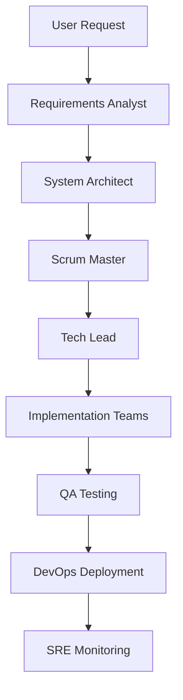

# Agent Army - Production-Grade Multi-Agent Development Framework

> A sophisticated multi-agent coordination system for software development projects, powered by Claude Code and Model Context Protocol (MCP) servers.

[](https://github.com/your-org/agent-army-trial)
[](https://opensource.org/licenses/MIT)
[](https://docs.anthropic.com/claude/docs/claude-code)

## 🚀 Overview

Agent Army is a production-grade multi-agent framework that orchestrates specialized AI agents to handle complex software development workflows. It features:

- **16 specialized agents** with distinct roles and responsibilities
- **5 MCP servers** providing comprehensive tooling capabilities
- **Advanced hook system** for workflow automation and monitoring
- **Hierarchical coordination** with proper task management and handoff chains

## 🏗️ Architecture

### Agent Hierarchy

```
📊 Meta Level (God Agent)
├── 🎯 Strategic Level
│   ├── Requirements Analyst (Business & Product)
│   └── System Architect (Technical Architecture)
├── 📋 Tactical Level
│   ├── Scrum Master (Project Management)
│   └── Tech Lead (Technical Coordination)
└── 🛠️ Implementation Level
    ├── Backend Engineers (API & Database)
    ├── Frontend Engineers (UI & UX)
    ├── Integration Engineers (APIs & Services)
    ├── Data Engineers (ETL & Analytics)
    ├── QA Engineers (Testing & Quality)
    ├── Security Engineers (Security & Compliance)
    ├── DevOps Engineers (CI/CD & Deployment)
    ├── SRE Engineers (Reliability & Monitoring)
    ├── Cloud Architects (Infrastructure)
    └── Technical Writers (Documentation)
```

### MCP Server Infrastructure

| Server | Purpose | Tools Provided |
|--------|---------|---------------|
| **workspace** | Project analysis & management | File operations, git, metrics, dependencies |
| **docs** | Document registry & management | Document creation, search, categorization |
| **execution** | Code execution & testing | Runtime environments, testing frameworks |
| **coord** | Agent coordination & communication | Task management, message passing, workflows |
| **validation** | Code quality & validation | Linting, formatting, type checking |

### Communication Flow



## 📋 Prerequisites

### Required Software

- **Python 3.8+** with pip
- **Node.js 16+** (for JavaScript hook scripts)
- **Git** for version control
- **Claude Code CLI** installed and configured

### System Requirements

- **Memory**: 4GB+ RAM recommended
- **Storage**: 2GB+ free space
- **Network**: Internet connection for Claude API
- **OS**: Linux, macOS, or Windows (WSL2 recommended)

## 🚀 Quick Start

### 1. Clone and Setup

```bash
# Clone the repository
git clone <your-repo-url>
cd agent-army-trial

# Setup Python environment
cd .claude/mcp
python -m venv venv
source venv/bin/activate  # On Windows: venv\Scripts\activate
pip install -r requirements.txt  # Install when requirements.txt exists

# Install MCP dependencies
pip install mcp anthropic uvicorn starlette
```

### 2. Verify Installation

```bash
# Test MCP server functionality
python servers/core/workspace.py --test
python servers/core/docs.py --test
python servers/core/execution.py --test
python servers/core/coord.py --test
python servers/core/validation.py --test
```

### 3. Configure Claude Code

The MCP servers are automatically configured in your Claude Code setup. Verify with:

```bash
claude mcp list
```

You should see 5 servers: workspace, docs, execution, coord, and validation.

### 4. Test Agent System

```bash
# Start Claude Code in the project directory
cd /path/to/agent-army-trial
claude

# Test agent functionality
"Act as scrum-master and create a sample sprint plan"
```

## 🎯 Agent Roles & Responsibilities

### Strategic Level

#### 🔍 Requirements Analyst
- **Purpose**: Gather and analyze business requirements
- **Tools**: Document management, web research, stakeholder communication
- **Outputs**: Requirements documents, user stories, acceptance criteria

#### 🏗️ System Architect  
- **Purpose**: Design technical architecture and system structure
- **Tools**: Architecture tools, documentation, technical analysis
- **Outputs**: Architecture documents, technical specifications, design patterns

### Tactical Level

#### 📋 Scrum Master
- **Purpose**: Project management and agile coordination
- **Tools**: Task management, team coordination, progress tracking
- **Outputs**: Sprint plans, progress reports, team coordination

#### 👨‍💼 Tech Lead
- **Purpose**: Technical leadership and developer coordination  
- **Tools**: Code review, task assignment, technical oversight
- **Outputs**: Technical decisions, code reviews, team assignments

### Implementation Level

#### 🖥️ Senior Backend Engineer
- **Purpose**: Backend development and API design
- **Tools**: Code execution, database operations, API development
- **Outputs**: Backend services, APIs, database schemas

#### 🎨 Senior Frontend Engineer
- **Purpose**: Frontend development and user interface
- **Tools**: UI frameworks, responsive design, user experience
- **Outputs**: User interfaces, frontend applications, UX components

#### 🔄 Integration Engineer
- **Purpose**: Third-party integrations and API connections
- **Tools**: API testing, webhook setup, external service integration
- **Outputs**: Integration solutions, API connectors, data flows

#### 📊 Data Engineer
- **Purpose**: Data processing and analytics infrastructure
- **Tools**: ETL pipelines, data warehouse, analytics tools
- **Outputs**: Data pipelines, analytics dashboards, reports

#### 🧪 QA Engineer
- **Purpose**: Quality assurance and testing
- **Tools**: Test frameworks, automated testing, performance testing
- **Outputs**: Test plans, automated tests, quality reports

#### 🔒 Security Engineer
- **Purpose**: Security assessment and compliance
- **Tools**: Security scanning, vulnerability assessment, compliance tools
- **Outputs**: Security audits, vulnerability reports, compliance documentation

#### 🚀 DevOps Engineer
- **Purpose**: CI/CD and deployment automation
- **Tools**: Deployment pipelines, container orchestration, infrastructure automation
- **Outputs**: CI/CD pipelines, deployment scripts, infrastructure code

#### 📡 SRE Engineer
- **Purpose**: Site reliability and monitoring
- **Tools**: Monitoring systems, alerting, performance analysis
- **Outputs**: Monitoring dashboards, SLA reports, incident responses

#### ☁️ Cloud Architect
- **Purpose**: Cloud infrastructure design and optimization
- **Tools**: Cloud services, infrastructure planning, cost optimization
- **Outputs**: Cloud architecture, infrastructure plans, cost analysis

#### 📝 Technical Writer
- **Purpose**: Documentation and user guides
- **Tools**: Documentation tools, content management, technical writing
- **Outputs**: API documentation, user guides, technical specifications

## 🛠️ MCP Server Details

### Workspace Server (`workspace.py`)
Provides comprehensive project analysis and workspace management capabilities.

**Key Tools:**
- `mcp__workspace__analyze` - Complete project analysis
- `mcp__workspace__detect` - Framework and language detection
- `mcp__workspace__context` - AI-optimized project context
- `mcp__workspace__find` - File pattern matching
- `mcp__workspace__git` - Git repository operations

### Document Registry Server (`docs.py`)
Dynamic document management system maintaining a complete index of all project documentation.

**Key Tools:**
- `mcp__docs__register` - Register new documents
- `mcp__docs__find` - Search existing documentation
- `mcp__docs__create` - Create documents with templates
- `mcp__docs__update` - Update document versions

### Execution Server (`execution.py`)
Code execution and testing capabilities across multiple languages and frameworks.

**Key Tools:**
- `mcp__execution__run` - Execute code snippets
- `mcp__execution__test` - Run project tests
- `mcp__execution__api` - Test API endpoints
- `mcp__execution__debug` - Debug code with analysis

### Coordination Server (`coord.py`)
Centralized task management and agent communication system.

**Key Tools:**
- `mcp__coord__task_create` - Create new tasks
- `mcp__coord__task_assign` - Assign tasks to agents
- `mcp__coord__message_send` - Inter-agent communication
- `mcp__coord__workflow_start` - Start multi-agent workflows

### Validation Server (`validation.py`)
Code quality assurance and validation tools.

**Key Tools:**
- `mcp__validation__syntax` - Syntax error checking
- `mcp__validation__lint` - Code linting with auto-fix
- `mcp__validation__format` - Code formatting
- `mcp__validation__validate` - Comprehensive validation

## 🎣 Hook System

### Available Hooks

#### Communication Tracker (`communication-tracker.py`)
Tracks all agent communications and generates analytics.

**Features:**
- Communication frequency analysis
- Agent activity monitoring
- Handoff chain tracking
- Performance metrics

#### Orchestrator (`orchestrator.py`)
Central coordination and validation system.

**Features:**
- Permission validation
- Communication flow control
- Suggestion system
- Error handling

#### Smart Suggestions (`smart-suggestions.py`)
Provides intelligent suggestions for workflow improvements.

**Features:**
- Workflow optimization
- Best practice recommendations
- Performance insights
- Process improvements

### Hook Configuration

Hooks are configured in `.claude/example-hooks-config.json`:

```json
{
  "hooks": {
    "user-prompt-submit-hook": {
      "command": "python3",
      "args": [".claude/hooks/communication-tracker.py"]
    },
    "agent-prompt-submit-hook": {
      "command": "python3", 
      "args": [".claude/hooks/orchestrator.py"]
    }
  }
}
```

## 📊 Usage Examples

### Example 1: Feature Development Workflow

```bash
# 1. Start with requirements analysis
"Act as requirements-analyst and analyze the need for a user authentication system"

# 2. Create technical architecture
"Act as system-architect and design the authentication system architecture"

# 3. Plan the work
"Act as scrum-master and create a sprint plan for implementing authentication"

# 4. Assign technical tasks
"Act as tech-lead and break down the authentication work into specific development tasks"

# 5. Implement backend
"Act as senior-backend-engineer and implement the authentication API"

# 6. Implement frontend  
"Act as senior-frontend-engineer and create the login/signup UI"

# 7. Test the system
"Act as qa-engineer and create comprehensive tests for the authentication system"

# 8. Deploy
"Act as devops-engineer and set up CI/CD for the authentication service"
```

### Example 2: Bug Investigation Workflow

```bash
# 1. Initial analysis
"Act as sre-engineer and investigate the reported performance issue"

# 2. Technical deep-dive
"Act as senior-backend-engineer and analyze the database query performance"

# 3. Security review
"Act as security-engineer and check if this could be a security issue"

# 4. Fix implementation
"Act as tech-lead and coordinate the bug fix across teams"

# 5. Quality assurance
"Act as qa-engineer and verify the fix resolves the issue"
```

## 🔧 Troubleshooting

### Common Issues

#### MCP Servers Not Loading
```bash
# Check server status
claude mcp list

# Verify Python environment
cd .claude/mcp
source venv/bin/activate
python -c "import mcp; print('MCP installed successfully')"

# Test individual servers
python servers/core/workspace.py
```

#### Agent Communication Errors
```bash
# Check coordination server
python .claude/mcp/servers/core/coord.py --health-check

# Verify hook system
python .claude/hooks/orchestrator.py --test
```

#### Permission Issues
```bash
# Check file permissions
ls -la .claude/
chmod +x .claude/hooks/*.py
```

### Log Locations

- **MCP Server Logs**: `.claude/mcp/logs/`
- **Agent Communication**: `.claude/logs/communication-*.jsonl`
- **Hook Activity**: `.claude/logs/orchestrator-*.jsonl`

## 🤝 Contributing

### Development Setup

1. Fork the repository
2. Create a feature branch
3. Make your changes
4. Test with all agents and MCP servers
5. Submit a pull request

### Adding New Agents

1. Create agent definition in `.claude/agents/<agent-name>.md`
2. Update `agent-registry.json`
3. Add agent to hook permissions in `orchestrator.py`
4. Test agent functionality

### Adding MCP Tools

1. Add tool to appropriate MCP server
2. Update tool documentation
3. Test tool integration
4. Update agent configurations as needed

## 📄 License

This project is licensed under the MIT License - see the [LICENSE](LICENSE) file for details.

## 🆘 Support

- **Documentation**: Check this README and agent documentation in `.claude/agents/`
- **Issues**: Report bugs and issues in the GitHub repository
- **Discussions**: Use GitHub Discussions for questions and ideas
- **Claude Code Docs**: https://docs.anthropic.com/claude/docs/claude-code

## 🏆 Acknowledgments

- **Anthropic** for Claude Code and MCP protocol
- **Contributors** who helped build and improve the agent army
- **Open Source Community** for inspiration and best practices

---

**Production Grade ⭐ | Multi-Agent Architecture ⭐ | Claude Code Powered ⭐**