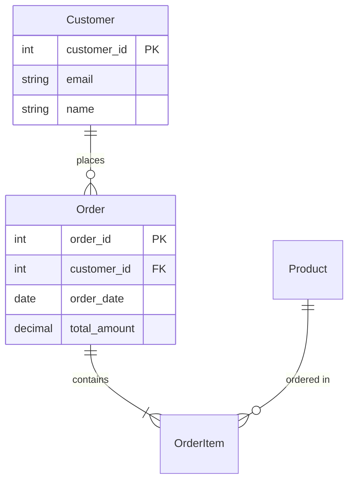

# Data Dictionary
**Project:** [Project Name]
**Document ID:** DD-[PROJECT]-[YYYY-MM-DD]
**Version:** 1.0
**Last Updated:** [Date]
**Author:** Requirements Analyst
**Status:** [Draft/Review/Approved]

## Version History
| Version | Date | Author | Changes |
|---------|------|--------|---------|
| 1.0 | [Date] | [Name] | Initial data dictionary |

## 1. Introduction
### 1.1 Purpose
[Purpose of this data dictionary]

### 1.2 Scope
[Systems and databases covered]

### 1.3 Naming Conventions
- **Tables:** [Convention, e.g., snake_case, singular]
- **Columns:** [Convention, e.g., snake_case]
- **Indexes:** [Convention, e.g., idx_table_column]
- **Foreign Keys:** [Convention, e.g., fk_table_reference]

## 2. Entity Overview

### 2.1 Entity Relationship Diagram


### 2.2 Entity Summary
| Entity Name | Table Name | Description | Record Count | Growth Rate |
|-------------|------------|-------------|--------------|-------------|
| Customer | customers | Customer master data | ~[Count] | [Rate/month] |
| Order | orders | Order transactions | ~[Count] | [Rate/month] |
| Product | products | Product catalog | ~[Count] | [Rate/month] |

## 3. Detailed Entity Definitions

### Entity: Customer
**Table Name:** customers
**Description:** [Detailed description of the entity]

#### Attributes
| Attribute Name | Column Name | Data Type | Size | Nullable | Default | Description | Example |
|----------------|-------------|-----------|------|----------|---------|-------------|---------|
| Customer ID | customer_id | INTEGER | - | No | AUTO_INCREMENT | Unique identifier | 12345 |
| Email | email | VARCHAR | 255 | No | - | Customer email address | john@example.com |
| First Name | first_name | VARCHAR | 100 | No | - | Customer first name | John |
| Last Name | last_name | VARCHAR | 100 | No | - | Customer last name | Doe |
| Phone | phone | VARCHAR | 20 | Yes | NULL | Contact phone number | +1-555-0123 |
| Created Date | created_at | TIMESTAMP | - | No | CURRENT_TIMESTAMP | Record creation date | 2024-01-09 10:30:00 |
| Updated Date | updated_at | TIMESTAMP | - | No | CURRENT_TIMESTAMP ON UPDATE | Last update date | 2024-01-09 14:45:00 |
| Status | status | ENUM | - | No | 'active' | Account status | active/inactive/suspended |

#### Keys & Indexes
| Type | Name | Columns | Description |
|------|------|---------|-------------|
| Primary Key | PK_customers | customer_id | Primary key |
| Unique Index | UQ_customers_email | email | Ensures email uniqueness |
| Index | IDX_customers_status | status | For status filtering |
| Index | IDX_customers_created | created_at | For date range queries |

#### Relationships
| Relationship | Related Entity | Type | Foreign Key | Description |
|--------------|----------------|------|-------------|-------------|
| Has Many | Order | 1:N | orders.customer_id | Customer places orders |
| Has Many | Address | 1:N | addresses.customer_id | Customer has addresses |

#### Business Rules
- Email must be unique across the system
- Email must be valid format (contains @ and domain)
- Phone number should include country code
- Status changes must be logged in audit table

#### Data Quality Rules
| Rule | Validation | Action on Violation |
|------|------------|-------------------|
| Email Format | Regex: ^[a-zA-Z0-9._%+-]+@[a-zA-Z0-9.-]+\.[a-zA-Z]{2,}$ | Reject |
| Phone Format | Regex: ^\+?[1-9]\d{1,14}$ | Warning |
| Name Length | Min: 1, Max: 100 | Reject |

---

### Entity: Order
**Table Name:** orders
**Description:** [Detailed description]

#### Attributes
| Attribute Name | Column Name | Data Type | Size | Nullable | Default | Description | Example |
|----------------|-------------|-----------|------|----------|---------|-------------|---------|
| Order ID | order_id | INTEGER | - | No | AUTO_INCREMENT | Unique identifier | 10001 |
| Customer ID | customer_id | INTEGER | - | No | - | Reference to customer | 12345 |
| Order Date | order_date | DATETIME | - | No | CURRENT_TIMESTAMP | When order was placed | 2024-01-09 10:30:00 |
| Total Amount | total_amount | DECIMAL | 10,2 | No | 0.00 | Order total | 156.99 |
| Status | status | VARCHAR | 20 | No | 'pending' | Order status | pending/confirmed/shipped |

[Continue with similar structure for other entities]

## 4. Code Lists & Lookups

### 4.1 Status Codes
| Entity | Code | Description | Active |
|--------|------|-------------|--------|
| Customer | active | Active customer | Yes |
| Customer | inactive | Inactive customer | Yes |
| Customer | suspended | Suspended account | Yes |
| Order | pending | Awaiting confirmation | Yes |
| Order | confirmed | Order confirmed | Yes |
| Order | shipped | Order shipped | Yes |
| Order | delivered | Order delivered | Yes |
| Order | cancelled | Order cancelled | Yes |

### 4.2 Country Codes
| Code | Country | ISO Code |
|------|---------|----------|
| US | United States | USA |
| GB | United Kingdom | GBR |
| CA | Canada | CAN |

## 5. Data Flows

### 5.1 Data Flow Diagram
```
[Source System] → [ETL Process] → [Data Warehouse] → [Reporting]
```

### 5.2 Data Sources
| Source System | Data Elements | Frequency | Method | Format |
|---------------|---------------|-----------|--------|--------|
| CRM System | Customer data | Real-time | API | JSON |
| E-commerce Platform | Order data | Real-time | Webhook | JSON |
| Inventory System | Product data | Hourly | Batch | CSV |

### 5.3 Data Destinations
| Destination | Data Elements | Frequency | Method | Format |
|-------------|---------------|-----------|--------|--------|
| Analytics Dashboard | Aggregated metrics | Real-time | API | JSON |
| Monthly Reports | Full dataset | Monthly | Scheduled | Excel |
| Data Lake | Raw data | Real-time | Stream | Parquet |

## 6. Data Transformations

### 6.1 Calculated Fields
| Field Name | Calculation | Description | Used In |
|------------|-------------|-------------|---------|
| customer_lifetime_value | SUM(orders.total_amount) | Total customer spending | Analytics |
| order_item_count | COUNT(order_items) | Number of items in order | Order processing |
| days_since_registration | DATEDIFF(NOW(), created_at) | Customer tenure | Segmentation |

### 6.2 Data Mappings
| Source Field | Target Field | Transformation | Notes |
|--------------|--------------|----------------|-------|
| first_name + last_name | full_name | CONCAT(first_name, ' ', last_name) | Display purposes |
| phone | formatted_phone | Format to E.164 | International format |
| email | email_domain | SUBSTRING_INDEX(email, '@', -1) | Analytics |

## 7. Data Quality & Governance

### 7.1 Data Quality Metrics
| Metric | Target | Current | Measurement |
|--------|--------|---------|-------------|
| Completeness | >98% | [%] | Non-null required fields |
| Accuracy | >99% | [%] | Validation rule pass rate |
| Consistency | >99% | [%] | Cross-reference match rate |
| Timeliness | <5 min | [time] | Data freshness |

### 7.2 Data Ownership
| Data Domain | Data Owner | Data Steward | Contact |
|-------------|------------|--------------|---------|
| Customer Data | [Name] | [Name] | [Email] |
| Order Data | [Name] | [Name] | [Email] |
| Product Data | [Name] | [Name] | [Email] |

### 7.3 Data Retention
| Data Type | Retention Period | Archive Method | Deletion Method |
|-----------|------------------|----------------|-----------------|
| Transaction Data | 7 years | Cold storage | Soft delete |
| Customer Data | Until request | N/A | GDPR compliant |
| Log Data | 90 days | Compressed archive | Hard delete |

## 8. Security & Privacy

### 8.1 Data Classification
| Data Element | Classification | Encryption | Access Control |
|--------------|----------------|------------|----------------|
| customer.ssn | Highly Sensitive | AES-256 | Role-based |
| customer.email | Sensitive | TLS in transit | Role-based |
| order.total | Internal | No | Department |
| product.name | Public | No | Open |

### 8.2 PII Elements
| Field | PII Type | Masking Rule | Retention |
|-------|----------|--------------|-----------|
| email | Email address | Show domain only | Until deletion request |
| phone | Phone number | Show last 4 digits | Until deletion request |
| ssn | Social Security | Fully masked | 7 years |

## 9. API Specifications

### 9.1 Data Access APIs
| Endpoint | Method | Parameters | Response | Rate Limit |
|----------|--------|------------|----------|------------|
| /api/customers/{id} | GET | id: integer | Customer object | 100/hour |
| /api/orders | GET | status, date_from, date_to | Order array | 100/hour |
| /api/products/search | POST | query, filters | Product array | 1000/hour |

### 9.2 Data Update APIs
| Endpoint | Method | Payload | Response | Validation |
|----------|--------|---------|----------|------------|
| /api/customers | POST | Customer object | Created customer | Email unique |
| /api/orders/{id} | PUT | Order updates | Updated order | Status transitions |

## 10. Change Log

### 10.1 Schema Changes
| Date | Version | Change | Reason | Impact |
|------|---------|--------|--------|--------|
| [Date] | 1.1 | Added customer.preferred_language | Internationalization | Low |
| [Date] | 1.2 | Indexed order.order_date | Performance | None |

### 10.2 Pending Changes
| Planned Date | Change | Reason | Impact Assessment |
|--------------|--------|--------|------------------|
| [Date] | Add customer.loyalty_tier | Loyalty program | Medium - new field |
| [Date] | Deprecate product.old_sku | SKU migration | High - breaking change |

## Appendices

### A. SQL DDL Scripts
```sql
-- Customer table creation
CREATE TABLE customers (
    customer_id INT PRIMARY KEY AUTO_INCREMENT,
    email VARCHAR(255) UNIQUE NOT NULL,
    first_name VARCHAR(100) NOT NULL,
    last_name VARCHAR(100) NOT NULL,
    created_at TIMESTAMP DEFAULT CURRENT_TIMESTAMP
);
```

### B. Sample Data
```json
{
  "customer": {
    "customer_id": 12345,
    "email": "john.doe@example.com",
    "first_name": "John",
    "last_name": "Doe"
  }
}
```

### C. Glossary
| Term | Definition |
|------|------------|
| PII | Personally Identifiable Information |
| FK | Foreign Key |
| PK | Primary Key |