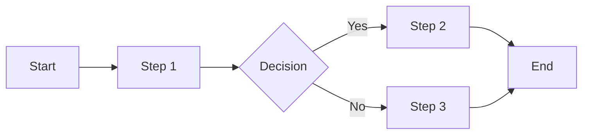

# Process Documentation
**Process Name:** [Name]
**Document ID:** PROC-[NAME]-[YYYY-MM-DD]
**Version:** 1.0
**Last Updated:** [Date]
**Process Owner:** [Name]

## Version History
| Version | Date | Author | Changes |
|---------|------|--------|---------|
| 1.0 | [Date] | [Name] | Initial documentation |

## 1. Process Overview
### 1.1 Purpose
[Why this process exists]

### 1.2 Scope
[What's included/excluded]

### 1.3 Process Triggers
[What initiates this process]

## 2. AS-IS Process Map
### 2.1 High-Level Flow

### 2.2 Detailed Steps
| Step | Actor | Action | System | Output | Duration |
|------|-------|--------|--------|--------|----------|
| 1 | [Role] | [Action] | [System used] | [Output] | [Time] |

### 2.3 Pain Points
- Pain Point 1: [Description and impact]
- Pain Point 2: [Description and impact]

## 3. TO-BE Process Design
### 3.1 Improvement Opportunities
| Current Issue | Proposed Solution | Expected Benefit |
|---------------|------------------|------------------|
| [Issue] | [Solution] | [Benefit] |

### 3.2 TO-BE Process Flow
[Similar structure to AS-IS]

### 3.3 Implementation Requirements
- Requirement 1: [Description]
- Requirement 2: [Description]

## 4. SIPOC Analysis
| Suppliers | Inputs | Process | Outputs | Customers |
|-----------|--------|---------|---------|-----------|
| [Supplier] | [Input] | [Process step] | [Output] | [Customer] |

## 5. Performance Metrics
| Metric | Current | Target | Measurement Method |
|--------|---------|--------|-------------------|
| [Metric] | [Value] | [Target] | [How measured] |

## 6. Risks & Controls
| Risk | Impact | Current Control | Proposed Control |
|------|--------|-----------------|------------------|
| [Risk] | [Impact] | [Control] | [New control] |