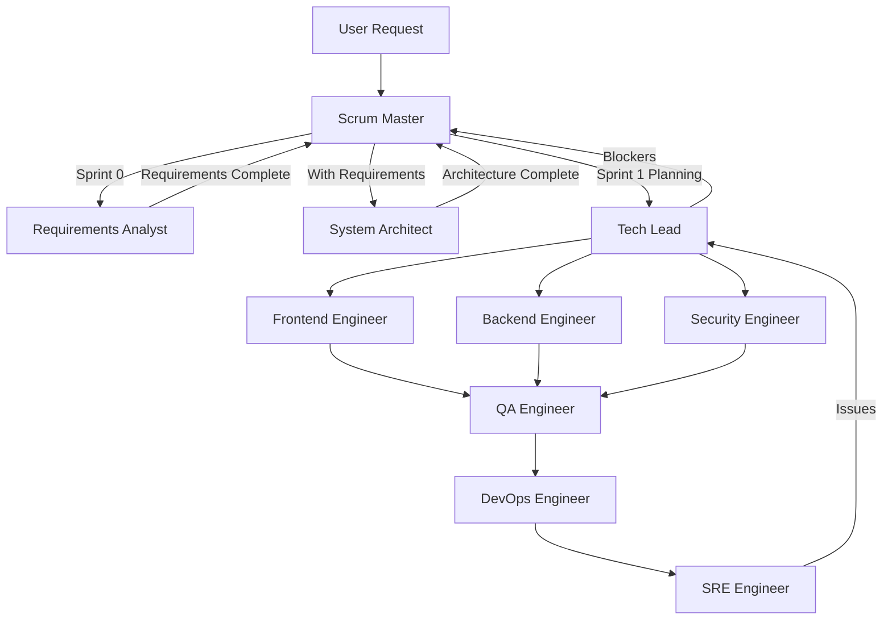

# Agent Handoff Patterns

## Corrected Agent Flow



## Handoff Rules

### 1. Project Initiation
- **Trigger**: User mentions project keywords
- **First Agent**: Scrum Master (auto-triggered)
- **Action**: Detect phase, start Sprint 0

### 2. Sprint 0 Handoffs
```
Scrum Master → Requirements Analyst
  Context: "Gather requirements for [project]"
  Deliverable: User stories, acceptance criteria, product backlog
  
Scrum Master → System Architect
  Context: "Design architecture based on requirements"
  Deliverable: Technical architecture, system design
  Prerequisite: Requirements complete
```

### 3. Sprint 1+ Handoffs
```
Scrum Master → Tech Lead
  Context: "Sprint backlog with selected user stories"
  Deliverable: Technical task breakdown
  
Tech Lead → Engineers
  Context: "Specific technical tasks"
  Deliverable: Working code
  
Engineers → QA Engineer
  Context: "Feature complete, ready for testing"
  Deliverable: Test results, bug reports
  
QA Engineer → DevOps
  Context: "Tests passed, ready for deployment"
  Deliverable: Deployed application
```

## Handoff Protocol

### Required Information
Each handoff must include:
1. **Task ID**: Unique identifier
2. **Context**: What was done, what needs doing
3. **Artifacts**: Documents, code, test results
4. **Dependencies**: What this blocks/unblocks
5. **Deadline**: When this needs completion

### Handoff Message Format
```json
{
  "handoff": {
    "from": "agent-name",
    "to": "agent-name",
    "task_id": "TASK-123",
    "context": {
      "completed": "What I finished",
      "needed": "What you need to do",
      "artifacts": ["file1.md", "file2.ts"],
      "dependencies": ["TASK-124"],
      "deadline": "2024-01-25"
    }
  }
}
```

## Invalid Handoffs (Blocked)

### Cannot Skip Levels
- ❌ Scrum Master → Frontend Engineer (must go through Tech Lead)
- ❌ Requirements Analyst → Backend Engineer (must go through Tech Lead)
- ❌ System Architect → QA Engineer (must go through implementation)

### Cannot Skip Phases
- ❌ Start Sprint 1 without requirements
- ❌ Start development without architecture
- ❌ Deploy without testing

## Escalation Paths

### Technical Escalation
```
Engineer → Tech Lead → System Architect
```

### Project Escalation
```
Tech Lead → Scrum Master → Stakeholder
```

### Quality Escalation
```
QA Engineer → Tech Lead → Scrum Master
```

## Parallel Work Patterns

### Can Work in Parallel
- Frontend & Backend Engineers (after API contract defined)
- Multiple engineers on different features
- Documentation while development ongoing

### Must Be Sequential
1. Requirements → Architecture → Development
2. Development → Testing → Deployment
3. Sprint Planning → Sprint Execution → Sprint Review

## Feedback Loops

### Quick Feedback
- Engineer ← → Engineer (pair programming)
- QA → Engineer (bug reports)
- Tech Lead → Engineer (code reviews)

### Sprint Feedback
- Sprint Retrospective → All team members
- Sprint Review → Stakeholders
- Velocity metrics → Scrum Master

## Handoff Validation

The orchestrator validates:
1. Agent is allowed to hand off to target
2. Prerequisites are met
3. Required artifacts exist
4. Target agent is available
5. No circular dependencies

## Monitoring Handoffs

Track:
- Handoff success rate
- Average handoff time
- Blocked handoffs
- Rework due to poor handoffs
- Agent availability