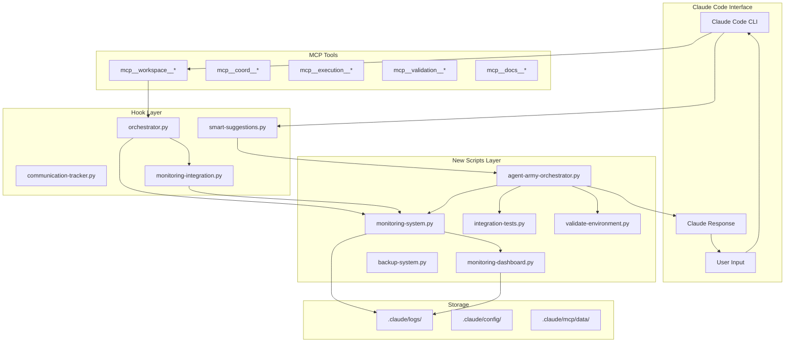

# Claude Code Integration Architecture

## 🏗️ How New Scripts Connect to Claude Code



## 📊 Integration Points Explained

### **1. When You Type in Claude Code**

```
You: "Create a user authentication API"
         ↓
[Claude Code CLI]
         ↓
[UserPromptSubmit Hook] → smart-suggestions.py
         ↓
[Monitoring Integration] → monitoring-system.py logs event
         ↓
[Orchestrator] → agent-army-orchestrator.py routes to agent
         ↓
[Agent Selection] → senior-backend-engineer
         ↓
[MCP Tools] → mcp__execution__run, mcp__workspace__analyze
         ↓
[Results] → Back to you
```

### **2. How Hooks Connect to New Scripts**

```python
# In .claude/settings.json
{
  "hooks": {
    "ToolUse": "./.claude/hooks/orchestrator.py",      # → Calls monitoring-system.py
    "UserPromptSubmit": "./.claude/hooks/smart-suggestions.py",  # → Logs to monitoring
    "Stop": "./.claude/hooks/communication-tracker.py"  # → Updates metrics
  }
}
```

### **3. Background Services**

```bash
# These run continuously in background
monitoring-system.py --daemon  # Watches everything
agent-army-orchestrator.py --daemon  # Coordinates components

# They observe Claude Code through:
- Hook events (real-time)
- MCP server status (polling)
- Log file monitoring (continuous)
- System resource tracking (periodic)
```

### **4. Direct Claude Code Commands**

You can invoke the new scripts directly from Claude Code:

```bash
# In Claude Code, you can say:
"Run the monitoring dashboard"
# Claude executes: python3 .claude/scripts/monitoring-dashboard.py

"Check system health"
# Claude executes: python3 .claude/scripts/agent-army-orchestrator.py --health

"Run integration tests"
# Claude executes: python3 .claude/scripts/integration-tests.py

"Backup the system"
# Claude executes: python3 .claude/scripts/backup-system.py --full
```

### **5. MCP Tool Integration**

When Claude uses MCP tools, the new scripts observe:

```python
# Claude Code uses:
mcp__coord__task_create(title="Build API", agent="backend-engineer")
         ↓
# orchestrator.py hook intercepts
         ↓
# monitoring-system.py logs the event
         ↓
# agent-army-orchestrator.py tracks workflow
         ↓
# integration-tests.py can verify it worked
```

## 🔄 Complete Integration Flow

### **Startup**
```bash
./start-agent-army.sh
```
1. Validates environment (`validate-environment.py`)
2. Registers MCP servers with Claude Code
3. Starts monitoring daemon (background)
4. Starts orchestrator daemon (background)
5. Hooks are ready to intercept Claude Code events

### **Runtime**
```
Claude Code Active
       ↓
    Hooks Listening → Trigger on events
       ↓
    Monitoring Recording → Track all activities
       ↓
    Orchestrator Coordinating → Manage workflows
       ↓
    Dashboard Available → View real-time status
```

### **Testing**
```bash
# Run from Claude Code or terminal
./run-tests.sh all
```
- Tests MCP connectivity
- Validates agent definitions
- Checks hook execution
- Verifies monitoring

## 📁 File Connections

| Claude Code Reads | Purpose | Updates By |
|-------------------|---------|------------|
| `.claude/settings.json` | Hook configuration | You/Admin |
| `.claude/agents/*.md` | Agent definitions | You/Admin |
| MCP registrations | Tool availability | `register-mcp-servers.sh` |
| `.claude/logs/*.jsonl` | Activity logs | Hooks & Monitoring |

| New Scripts Write | Purpose | Read By |
|-------------------|---------|----------|
| `.claude/logs/monitoring.log` | System events | Dashboard |
| `.claude/logs/alerts.jsonl` | Alert history | Dashboard |
| `.claude/logs/orchestrator.log` | Coordination logs | Debugging |
| `.claude/logs/events.jsonl` | All events | Monitoring Dashboard |

## 🎮 Control Commands

### From Claude Code:
```python
# Start everything
"Run ./start-agent-army.sh"

# Check status
"Show me the monitoring dashboard"
"What's the system health?"

# Run tests
"Test the agent workflows"
"Validate the environment"

# Backup
"Create a system backup"

# Stop everything
"Run ./stop-agent-army.sh"
```

### Direct Monitoring:
```bash
# Terminal 1: Start monitoring
python3 .claude/scripts/monitoring-system.py --daemon

# Terminal 2: View dashboard
python3 .claude/scripts/monitoring-dashboard.py

# Terminal 3: Use Claude Code normally
claude
# Everything is being monitored!
```

## 🔍 How to Verify Integration

1. **Check Hooks Are Working:**
```bash
# After using Claude Code, check:
cat .claude/logs/communication.jsonl | tail -5
# Should see recent events
```

2. **Check Monitoring Is Recording:**
```bash
python3 .claude/scripts/monitoring-system.py --status
# Should show metrics
```

3. **Check Orchestrator Is Running:**
```bash
ps aux | grep orchestrator
# Should see process
```

4. **Check MCP Tools Work:**
```bash
# In Claude Code:
"Use mcp__workspace__analyze"
# Should work and be logged
```

## 🚀 The Complete Picture

```
Claude Code (What you see)
    ↓
Hooks (Intercept events) 
    ↓
New Scripts (Process & monitor)
    ↓
MCP Tools (Execute actions)
    ↓
Logs & Metrics (Record everything)
    ↓
Dashboard (Visualize status)
```

Everything is connected through:
- **Event-driven hooks** (real-time)
- **Shared file system** (logs, configs)
- **Process communication** (daemons)
- **MCP tool protocol** (Claude Code native)