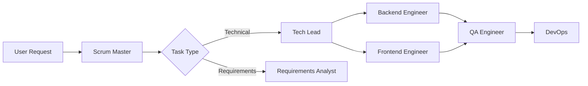

# Agent Army Integration Guide

> Complete guide for integrating all Agent Army components into a unified production system

## 🎯 Overview

The Agent Army consists of multiple interconnected systems that need to work together seamlessly:
- **16 Specialized Agents** - The workforce
- **5 MCP Servers** - Tool infrastructure  
- **Hook System** - Workflow automation
- **Monitoring & Alerting** - System health tracking
- **Testing Framework** - Quality assurance
- **Backup System** - Disaster recovery

This guide explains how to integrate these components into a cohesive, production-ready system.

## 🔗 Integration Architecture

```
┌─────────────────────────────────────────────────────────────┐
│                     Claude Code CLI                          │
├─────────────────────────────────────────────────────────────┤
│                                                               │
│  ┌─────────────┐  ┌─────────────┐  ┌─────────────┐         │
│  │    Hooks    │  │   Agents    │  │     MCP     │         │
│  │   System    │◄─►│   (16)     │◄─►│  Servers(5) │         │
│  └─────────────┘  └─────────────┘  └─────────────┘         │
│         ▲               ▲                ▲                   │
│         │               │                │                   │
│         └───────────────┴────────────────┘                   │
│                         │                                     │
│                    ┌────▼────┐                               │
│                    │Monitoring│                               │
│                    │  System  │                               │
│                    └──────────┘                               │
└─────────────────────────────────────────────────────────────┘
```

## 📦 Component Integration Points

### 1. **Hook System Integration**

The hook system orchestrates agent communication and workflow automation:

#### **A. Orchestrator Hook** (`orchestrator.py`)
- **Triggers**: Tool use events, agent handoffs
- **Integration with Agents**: Routes messages between agents based on hierarchy
- **Integration with MCP**: Validates tool permissions before execution
- **Integration with Monitoring**: Logs all orchestration events

```python
# Example: Hook triggers monitoring event
from monitoring_system import MonitoringEvent, EventType, AlertSeverity

def handle_agent_error(agent, error):
    monitor.add_event(MonitoringEvent(
        timestamp=datetime.now(),
        event_type=EventType.AGENT_ERROR,
        severity=AlertSeverity.HIGH,
        component=agent,
        message=str(error)
    ))
```

#### **B. Communication Tracker** (`communication-tracker.py`)
- **Triggers**: All agent-to-agent messages
- **Integration with Monitoring**: Tracks communication patterns and failures
- **Integration with Agents**: Maintains communication history

#### **C. Smart Suggestions** (`smart-suggestions.py`)
- **Triggers**: User prompts and agent requests
- **Integration with Agents**: Suggests appropriate agents for tasks
- **Integration with MCP**: Recommends relevant tools

### 2. **MCP Server Integration**

MCP servers provide tools that agents can use:

#### **A. Workspace Server** (`workspace.py`)
- **Used by**: All development agents
- **Integration**: Provides project analysis, file operations
- **Monitoring**: Tracks file operation success/failure

#### **B. Coordination Server** (`coord.py`)
- **Used by**: Scrum-master, tech-lead
- **Integration**: Manages task assignments and handoffs
- **Monitoring**: Tracks workflow completion times

#### **C. Execution Server** (`execution.py`)
- **Used by**: Backend/frontend engineers, QA
- **Integration**: Runs tests and code execution
- **Monitoring**: Tracks execution times and failures

#### **D. Validation Server** (`validation.py`)
- **Used by**: QA engineer, security engineer
- **Integration**: Validates code quality
- **Monitoring**: Tracks validation errors

#### **E. Docs Server** (`docs.py`)
- **Used by**: Technical writer, all agents
- **Integration**: Manages documentation
- **Monitoring**: Tracks documentation coverage

### 3. **Agent Integration**

Agents work together through defined handoff points:

```json
{
  "workflow": "feature_development",
  "handoff_chain": [
    {
      "from": "requirements-analyst",
      "to": "scrum-master",
      "trigger": "requirements_complete",
      "data": ["user_stories", "acceptance_criteria"]
    },
    {
      "from": "scrum-master",
      "to": "system-architect",
      "trigger": "sprint_planned",
      "data": ["task_breakdown", "priorities"]
    },
    {
      "from": "system-architect",
      "to": ["senior-backend-engineer", "senior-frontend-engineer"],
      "trigger": "architecture_defined",
      "data": ["api_specs", "data_models"]
    }
  ]
}
```

### 4. **Monitoring Integration**

The monitoring system observes all components:

#### **A. Event Collection**
```python
# In hooks/orchestrator.py
def on_tool_use(tool_name, agent, result):
    if result.get('error'):
        monitoring.add_event(
            event_type=EventType.AGENT_ERROR,
            severity=AlertSeverity.MEDIUM,
            component=f"{agent}/{tool_name}",
            message=result['error']
        )
```

#### **B. Health Checks**
```python
# Automated health check integration
def check_system_health():
    # Check MCP servers
    mcp_status = check_mcp_servers()
    
    # Check agent definitions
    agent_status = validate_agents()
    
    # Check hook system
    hook_status = test_hooks()
    
    return {
        'mcp': mcp_status,
        'agents': agent_status,
        'hooks': hook_status
    }
```

## 🚀 Implementation Steps

### Step 1: Initial Setup

```bash
# 1. Ensure all components are installed
python3 .claude/scripts/validate-environment.py

# 2. Register MCP servers
./.claude/scripts/register-mcp-servers.sh

# 3. Verify hook configuration
cat .claude/settings.json | jq '.hooks'
```

### Step 2: Configure Integration Points

```bash
# 1. Set environment variables
export AGENT_ARMY_PROJECT_ROOT="/home/dhara/PensionID/agent-army-trial"
export AGENT_ARMY_WEBHOOK_URL="https://hooks.slack.com/services/YOUR/WEBHOOK/URL"
export PYTHONPATH="${PYTHONPATH}:${AGENT_ARMY_PROJECT_ROOT}/.claude/scripts"

# 2. Update hook configurations to include monitoring
# Edit .claude/hooks/orchestrator.py to add:
import sys
sys.path.append('.claude/scripts')
from monitoring_system import AgentArmyMonitor

monitor = AgentArmyMonitor()
```

### Step 3: Start Services

```bash
# 1. Start monitoring daemon
python3 .claude/scripts/monitoring-system.py --start --daemon &

# 2. Start dashboard (optional, in separate terminal)
python3 .claude/scripts/monitoring-dashboard.py

# 3. Verify all systems are connected
python3 .claude/scripts/integration-tests.py
```

### Step 4: Configure Automated Workflows

Create workflow definitions that leverage all components:

```python
# .claude/workflows/feature_workflow.py
class FeatureWorkflow:
    def __init__(self):
        self.monitor = AgentArmyMonitor()
        self.coord_client = MCPCoordClient()
        
    def execute(self, requirements):
        # Step 1: Requirements analysis
        task_id = self.coord_client.create_task(
            title="Analyze requirements",
            assigned_to="requirements-analyst"
        )
        
        # Monitor task
        self.monitor.add_event(
            event_type=EventType.WORKFLOW_START,
            component="FeatureWorkflow",
            details={"task_id": task_id}
        )
        
        # Continue workflow...
```

## 🔄 Runtime Integration

### 1. **Automatic Agent Selection**

When a user makes a request, the system automatically:
1. Smart suggestions hook analyzes the request
2. Suggests appropriate agent(s)
3. Orchestrator routes to selected agent
4. Monitoring tracks the interaction

### 2. **Task Handoff Flow**



### 3. **Error Recovery**

When errors occur:
1. Monitoring system detects the error
2. Alerts are triggered based on severity
3. Recovery procedures are initiated
4. Fallback agents are activated if needed

## 📊 Monitoring Integration Points

### 1. **Hook Event Monitoring**

```python
# In each hook, add monitoring
def process_hook_event(event):
    start_time = time.time()
    
    try:
        result = handle_event(event)
        
        # Log successful event
        monitor.add_event(
            event_type=EventType.HOOK_SUCCESS,
            severity=AlertSeverity.INFO,
            component=hook_name,
            details={"duration": time.time() - start_time}
        )
        
    except Exception as e:
        # Log error
        monitor.add_event(
            event_type=EventType.HOOK_ERROR,
            severity=AlertSeverity.HIGH,
            component=hook_name,
            message=str(e)
        )
        raise
```

### 2. **MCP Tool Usage Tracking**

```python
# Track MCP tool usage
def on_mcp_tool_use(tool, params, result):
    metrics = {
        "tool": tool,
        "success": result.get("success", False),
        "duration": result.get("duration"),
        "agent": result.get("agent")
    }
    
    if not metrics["success"]:
        monitor.add_event(
            event_type=EventType.MCP_FAILURE,
            severity=AlertSeverity.MEDIUM,
            component=f"MCP/{tool}",
            details=metrics
        )
```

### 3. **Agent Performance Metrics**

```python
# Track agent performance
class AgentPerformanceTracker:
    def track_handoff(self, from_agent, to_agent, task_id):
        self.handoff_times[task_id] = time.time()
        
    def track_completion(self, agent, task_id):
        duration = time.time() - self.handoff_times.get(task_id, 0)
        
        if duration > TIMEOUT_THRESHOLD:
            monitor.add_event(
                event_type=EventType.WORKFLOW_TIMEOUT,
                severity=AlertSeverity.HIGH,
                component=agent,
                details={"task_id": task_id, "duration": duration}
            )
```

## 🧪 Testing Integration

### 1. **Continuous Integration Tests**

```bash
#!/bin/bash
# .claude/scripts/ci-integration.sh

# Run all integration tests
echo "Running Agent Army CI Pipeline"

# 1. Environment validation
python3 .claude/scripts/validate-environment.py || exit 1

# 2. MCP server tests
./.claude/scripts/run-tests.sh mcp || exit 1

# 3. Agent tests
./.claude/scripts/run-tests.sh agents || exit 1

# 4. Workflow tests
./.claude/scripts/run-tests.sh workflow || exit 1

# 5. Full integration tests
python3 .claude/scripts/integration-tests.py || exit 1

echo "✅ All integration tests passed"
```

### 2. **Pre-commit Hooks**

```bash
# .git/hooks/pre-commit
#!/bin/bash

# Validate agent definitions
python3 .claude/scripts/validate-environment.py --quick

# Check for sensitive data
grep -r "password\|secret\|key" .claude/agents/ && {
    echo "❌ Sensitive data detected in agent definitions"
    exit 1
}

# Run quick tests
./.claude/scripts/run-tests.sh environment
```

## 🔐 Security Integration

### 1. **Permission Validation**

All tool usage goes through permission checks:

```python
# In hooks/orchestrator.py
def validate_tool_permission(agent, tool):
    allowed_tools = AGENT_PERMISSIONS.get(agent, [])
    
    if tool not in allowed_tools:
        monitor.add_event(
            event_type=EventType.SECURITY_VIOLATION,
            severity=AlertSeverity.CRITICAL,
            component=agent,
            message=f"Unauthorized tool access: {tool}"
        )
        return False
    
    return True
```

### 2. **Audit Logging**

All actions are logged for audit:

```python
# Audit log integration
def log_audit_event(agent, action, details):
    audit_entry = {
        "timestamp": datetime.now().isoformat(),
        "agent": agent,
        "action": action,
        "details": details,
        "session_id": get_session_id()
    }
    
    with open('.claude/logs/audit.jsonl', 'a') as f:
        f.write(json.dumps(audit_entry) + '\n')
```

## 📈 Performance Optimization

### 1. **Caching Integration**

```python
# Cache frequently used data
class IntegrationCache:
    def __init__(self):
        self.agent_cache = {}
        self.mcp_status_cache = {}
        self.cache_ttl = 300  # 5 minutes
        
    def get_agent_status(self, agent):
        if agent in self.agent_cache:
            if time.time() - self.agent_cache[agent]['time'] < self.cache_ttl:
                return self.agent_cache[agent]['data']
        
        # Fetch fresh data
        status = fetch_agent_status(agent)
        self.agent_cache[agent] = {
            'data': status,
            'time': time.time()
        }
        return status
```

### 2. **Batch Processing**

```python
# Batch monitoring events to reduce overhead
class BatchEventProcessor:
    def __init__(self, batch_size=100, flush_interval=5):
        self.batch = []
        self.batch_size = batch_size
        self.flush_interval = flush_interval
        
    def add_event(self, event):
        self.batch.append(event)
        
        if len(self.batch) >= self.batch_size:
            self.flush()
            
    def flush(self):
        if self.batch:
            monitor.add_events_batch(self.batch)
            self.batch = []
```

## 🚀 Production Deployment

### 1. **Environment Setup**

```bash
# Production environment variables
export AGENT_ARMY_ENV="production"
export AGENT_ARMY_LOG_LEVEL="INFO"
export AGENT_ARMY_MONITORING="enabled"
export AGENT_ARMY_BACKUP_ENABLED="true"
```

### 2. **Service Management**

```bash
# Create systemd service for monitoring
sudo cat > /etc/systemd/system/agent-army-monitor.service << EOF
[Unit]
Description=Agent Army Monitoring Service
After=network.target

[Service]
Type=simple
User=$USER
WorkingDirectory=/home/dhara/PensionID/agent-army-trial
ExecStart=/usr/bin/python3 .claude/scripts/monitoring-system.py --start --daemon
Restart=always

[Install]
WantedBy=multi-user.target
EOF

sudo systemctl enable agent-army-monitor
sudo systemctl start agent-army-monitor
```

### 3. **Health Check Endpoint**

```python
# .claude/scripts/health_check_server.py
from http.server import HTTPServer, BaseHTTPRequestHandler
import json

class HealthCheckHandler(BaseHTTPRequestHandler):
    def do_GET(self):
        if self.path == '/health':
            status = check_system_health()
            self.send_response(200 if status['healthy'] else 503)
            self.send_header('Content-type', 'application/json')
            self.end_headers()
            self.wfile.write(json.dumps(status).encode())

if __name__ == '__main__':
    server = HTTPServer(('', 8080), HealthCheckHandler)
    server.serve_forever()
```

## 📊 Metrics Collection

### 1. **Prometheus Integration**

```python
# Export metrics for Prometheus
from prometheus_client import Counter, Histogram, Gauge

# Define metrics
agent_requests = Counter('agent_requests_total', 'Total agent requests', ['agent'])
task_duration = Histogram('task_duration_seconds', 'Task duration', ['agent', 'task_type'])
active_workflows = Gauge('active_workflows', 'Number of active workflows')

# Use in code
def track_agent_request(agent):
    agent_requests.labels(agent=agent).inc()
    
def track_task_duration(agent, task_type, duration):
    task_duration.labels(agent=agent, task_type=task_type).observe(duration)
```

### 2. **Grafana Dashboard**

Create dashboards to visualize:
- Agent activity and performance
- MCP server health
- Workflow completion rates
- Error rates and trends
- System resource usage

## 🔧 Troubleshooting Integration Issues

### Common Issues and Solutions

1. **MCP Servers Not Connecting**
   - Check: `claude mcp list`
   - Fix: `./.claude/scripts/register-mcp-servers.sh`

2. **Hooks Not Triggering**
   - Check: `.claude/settings.json` has correct hook config
   - Fix: Ensure hooks are executable and paths are correct

3. **Monitoring Not Receiving Events**
   - Check: Monitoring daemon is running
   - Fix: `python3 .claude/scripts/monitoring-system.py --start --daemon`

4. **Agent Handoffs Failing**
   - Check: Agent registry and coordination rules
   - Fix: Validate with `python3 .claude/scripts/integration-tests.py`

## 📚 Next Steps

1. **Customize Alert Rules**: Edit `.claude/config/alerting-config.json`
2. **Add Custom Workflows**: Create new workflow definitions
3. **Extend Monitoring**: Add custom metrics and dashboards
4. **Scale Horizontally**: Deploy multiple instances with load balancing
5. **Add External Integrations**: Connect to ticketing systems, CI/CD pipelines

---

**Remember**: Integration is an iterative process. Start with core components and gradually add more sophisticated features as your system matures.